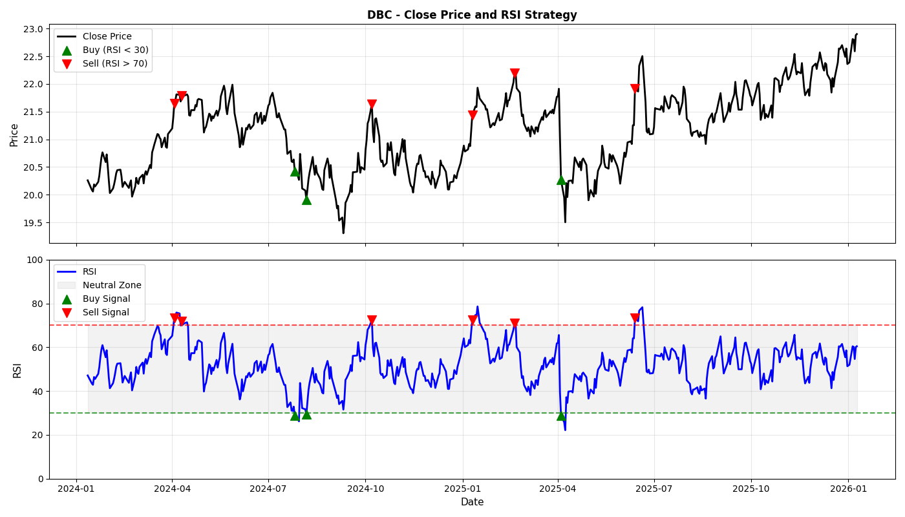
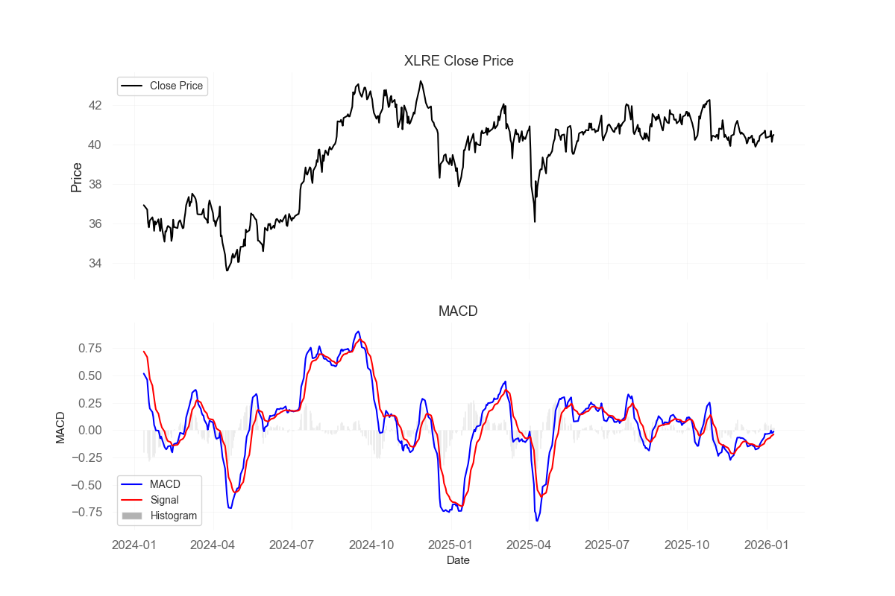

# Trading_Strategies

Este repositório tem como objetivo documentar, analisar e implementar **estratégias quantitativas de trading** em Python.  
O foco é unir **teoria, evidência empírica e prática**, apresentando desde estratégias clássicas até abordagens quantitativas modernas aplicadas a múltiplas classes de ativos.  

As ideias aqui apresentadas são baseadas em livros e pesquisas de autores como **Robert Carver**, **Ernie Chan**, **Marcos López de Prado**, entre outros.  
Essas referências estão detalhadas na seção [Referências](#referências).

## Sumário <!-- no toc -->

- [Trading\_Strategies](#trading_strategies)
  - [Sumário ](#sumário-)
- [O que é uma estratégia de Trading](#o-que-é-uma-estratégia-de-trading)
- [Indicadores Técnicos:](#indicadores-técnicos)
  - [RSI](#rsi)
  - [MACD](#macd)
- [Long\&Short](#longshort)
- [Referências](#referências)
- [Tópicos Futuros](#tópicos-futuros)

# O que é uma estratégia de Trading

Estratégias de **trading** são conjuntos de regras e métodos usados para tomar decisões sobre compra e venda de ativos, como ações, moedas, commodities ou criptomoedas. Essas estratégias buscam aproveitar movimentos de preço no mercado para obter lucros e geralmente são baseadas em análises técnicas, fundamentalistas, Quantitativas ou uma combinação delas.
Nesse repositório serão implementadas estratégias classícas com o Python, principalmente estratégias com foco em análises **Quantitativas**.

# Indicadores Técnicos:

Indicadores técnicos são transformações matemáticas aplicadas a séries de preços, com o objetivo de extrair informações relevantes sobre o comportamento do mercado.
Em termos quantitativos, eles funcionam como features derivadas, projetadas para resumir padrões estatísticos como momentum, reversão à média, tendência ou regime de volatilidade.

É importante ressaltar que indicadores não geram valor informacional por si só. Seu poder analítico depende de:

  - Hipóteses explícitas sobre a dinâmica do preço;
  - Forma de construção (janelas, normalizações, filtros);
  - Contexto de uso (isolados vs. combinados);
  - Avaliação empírica rigorosa (backtest).

Neste repositório, indicadores técnicos são tratados como objetos de estudo quantitativo, e não como regras heurísticas prontas para tomada de decisão.
Exemplos de Indicadores e testes de estratégias aplicados aqui! [Technical Indicators](technical_indicatos)

## RSI
O Relative Strength Index (RSI) é um indicador de momentum limitado em intervalo, geralmente entre 0 e 100, projetado para medir a velocidade e a persistência dos movimentos de preço ao longo do tempo.

Ver análise no arquivo [RSI](technical_indicatos/RSI.ipynb).

## MACD
O Moving Average Convergence Divergence (MACD) é um indicador de momentum e tendência baseado na diferença entre duas médias móveis exponenciais (EMAs). Ele busca capturar mudanças na direção do movimento ao medir a convergência e divergência entre uma EMA rápida e uma EMA lenta, usando uma linha de sinal (EMA do próprio MACD) para identificar possíveis pontos de inflexão.

Ver análise no arquivo [MACD](technical_indicatos/MACD.ipynb).

# Long&Short

A estratégia de **Long and Short** (também conhecida como **Pairs Trading**) é uma abordagem de investimento amplamente utilizada no mercado financeiro. Consiste em identificar ativos cujos preços estejam relacionados e operar com base no diferencial entre eles.
Nesse projeto foi realizado a estratégia de Long&Short por **Cointegração**.

[Long and Short por Cointegração](Pairs_trading/L&S_Cointegration.ipynb)

# Referências
 - [Advanced Futures Trading Strategies: 30 fully tested strategies for multiple trading styles and time frames](https://a.co/d/hhuEtMJ) - Robert Carver

# Tópicos Futuros
Temas que pretendo adicionar.

- Estratégia de Cruzamento de médias.
- Estratégia com Markov Model.
- Estratégia com Lógicas Fuzzy.
